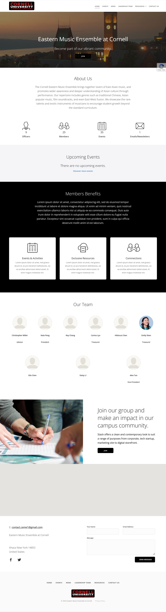
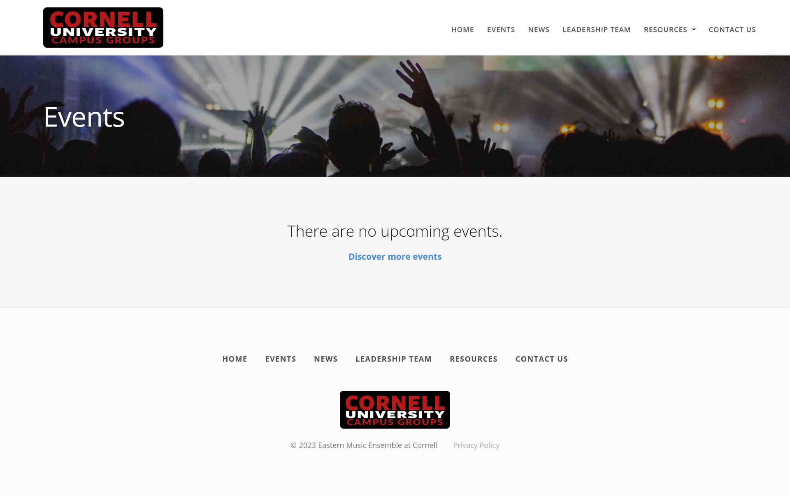
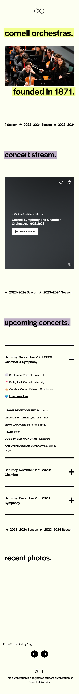
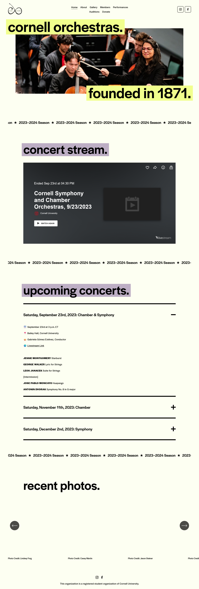
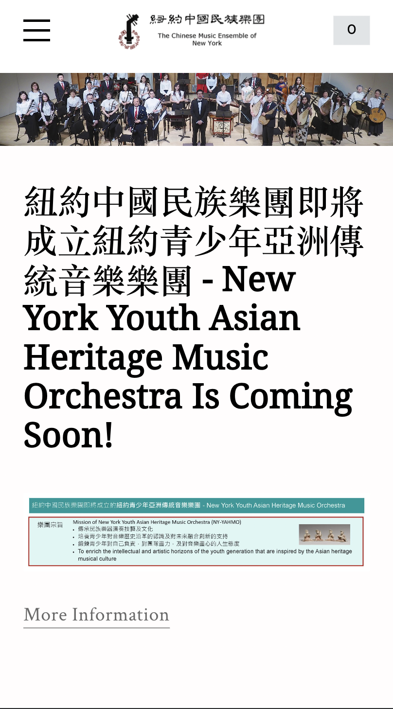
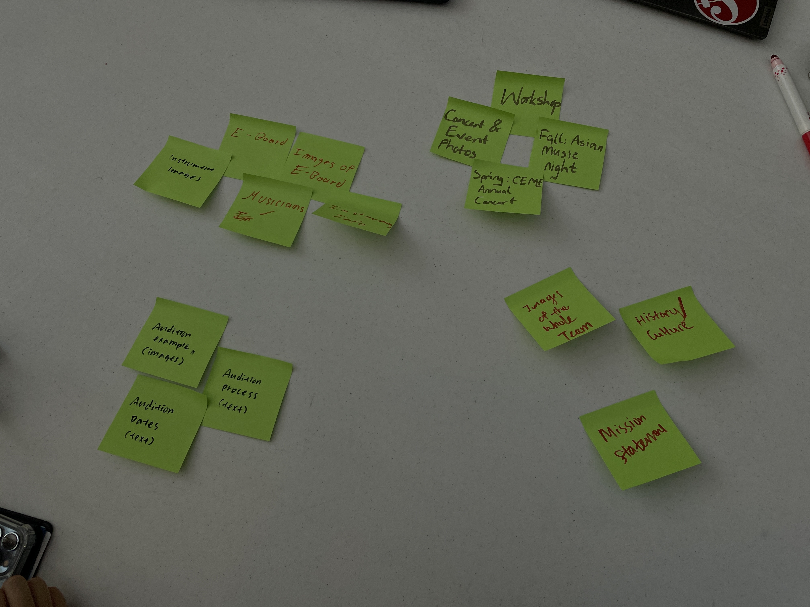
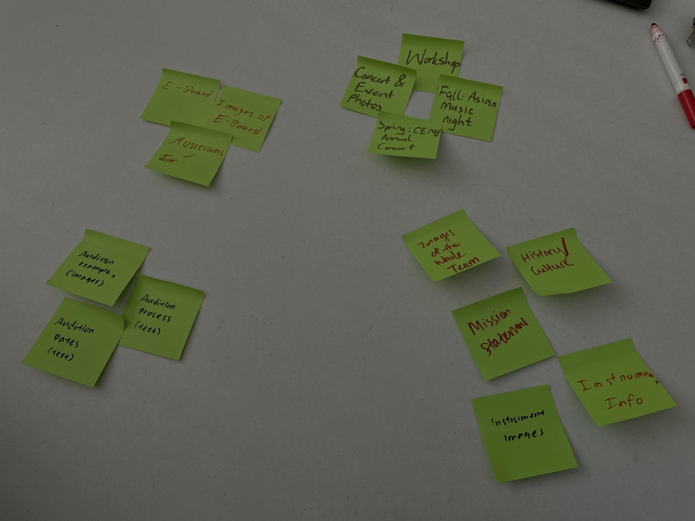
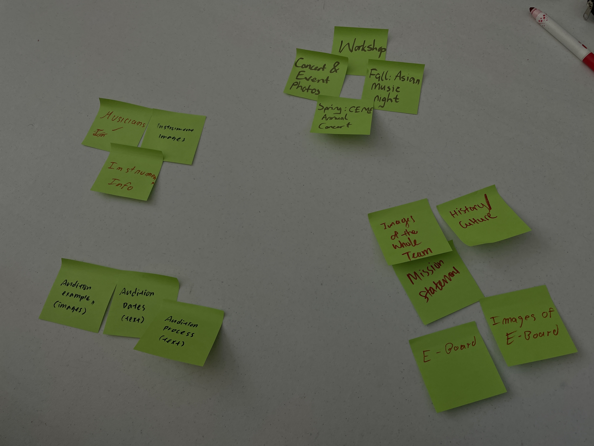

# Group Project: Design Journey

**For each milestone, complete only the sections that are labeled with that milestone.** Refine all sections before the final submission.

You are graded on your design process. If you later need to update your plan, **do not delete the original plan, leave it in place and append your new plan _below_ the original.** Then explain why you are changing your plan. Any time you update your plan, you're documenting your design process!

**Replace ALL _TODOs_ with your work.** (There should be no TODOs in the final submission.)

Be clear and concise in your writing. Bullets points are encouraged.

Place all design journey images inside the "design-plan" folder and then link them in Markdown so that they are visible in Markdown Preview.

**Everything, including images, must be visible in _Markdown: Open Preview_.** If it's not visible in the Markdown preview, then we can't grade it. We also can't give you partial credit either. **Please make sure your design journey should is easy to read for the grader;** in Markdown preview the question _and_ answer should have a blank line between them.

## Client (Milestone 1)

### Client Description (Milestone 1)
> Tell us about your client. Who is your client?
> Explain why your client meets the client rules in the project requirements.
>
> Our client is the Cornell Eastern Music Ensemble, or CEME, an ensemble at Cornell that aims to promote Asian culture through Eastern music and repertoire through performances, cultural events, and beginner instrument workshops. They have around twenty people in the ensemble, playing various instruments ranging from traditional instruments like the guzheng and guqin to Western instruments like violin and cello. As a close-knit group, they aim to share their culture among music lovers to immerse themselves in appreciating their culture through performances, concerts as well as their multicultural Asian Music Night. CEME also hopes that they can even participate in their group by joining the beginner instrument workshop series as well as auditioning to join their Eastern-Western fusion ensemble.
>
>Our client meets the client rules in the project requirements because it is a Cornell organization that needs a static website for their audience, music lovers who are unfamiliar with the Eastern realm. They hope to promote their culture through multicultural events and to encourage music lovers to watch their concerts and performances, and even join the beginner instrument workshop series. Although I, Ashley, was active in this ensemble last semester, I became inactive due to other time conflicts and other conflicts. We don’t consider ourselves as the intended of this website because none of us are active music lovers. For me, I already grew up as part of this culture, so I don’t consider myself as part of the audience.
>
>The client already had a website before, but they lost access to their original website due to a lack of yearly payment to the host service and an uncompleted website template on Campus Groups. Most of their content is on Instagram, so it wouldn’t be too difficult to build the website from scratch. The client is mainly looking for us to build a static website because they prefer their newly redesigned website to be more informative rather than promotional. They hope to implement a homepage that describes the purpose and mission of the club, a members highlight page, what they do (performances, concerts, events like Asian Music Night, beginner instrument workshop series, resources of Eastern music), and a recruitment/audition process for the club. There is nothing dynamic that needs to be implemented for this website. However, they do want some interactivity elements such as an image carousel to showcase images of what they do. They are still uncertain about other design patterns they want to implement, but we will have the follow-up updates during the next week. Overall, our client meets the client's requirements and they also understand the client's requirements.

### Client Questionnaire (Milestone 1)
> Develop a client questionnaire to learn more about your client and their goals.
> You may use the questionnaire below, you may modify the questionnaire below, or you may create your own.
>
>1. Describe your organization and its purpose.
>
>- The Cornell Eastern Music Ensemble (CEME) is a student-run music ensemble at Cornell that celebrates the rich cultural heritage of East Asian culture. Based on a traditional Chinese orchestra, CEME showcases its Chinese origins with traditional Chinese instruments. While rooted in Chinese origins, we embrace all forms of East Asian musical genres, both old and new, and even Eastern-Western music fusion. On campus, we aim to promote a wider awareness and deeper appreciation of Asian culture through performances and outreach programs. Overall, we want to create a space where music lovers can explore and experience the musical heritage of East Asia.
>
>2. What makes your organization and its services special or unique
>
>- Our organization promotes and celebrates diversity through the arts. Our most exciting event is Asian Music Night, where we invite other student groups to showcase their cultural performances, uniting cultural understanding and fostering diversity. Our ensemble is also the first to incorporate both Eastern and Western musical instruments, serving as a bridge of cultural diversity and one that is celebrated.
>
>3. Why are you looking for a new website or updating your existing site?
>
>- We want to update our existing site because the current website has outdated information and is inactive. We lost access to the host service, so we are unable to access our old information. We also want to shift the focus from promotion to providing information about us and Eastern music.
>
>4. Who do you want to visit your site? Who do you believe is your website's intended audience?
>
>- Our website aims to cater to people, especially music lovers, who are interested in learning more about our club, specifically, Cornell students and faculty members who are enthusiastic about exploring diverse cultural experiences through music
>
>5. When visiting your site, what actions do you want your visitors to take?
>
>- When visitors explore our website, we hope that the visitors can learn more about our presence and involvement at Cornell for cultural diversity as well as learn more about Eastern music culture, and heritage. If they are interested, we want them to attend our workshops and watch our performances as well.
>
>6. What are your goals for this site?
>
>- Our goals for this site are to let our visitors learn more about our club and our involvement on campus as well as learn more about the rich heritage of Eastern culture. We want to present a clear portrayal of our mission, our activities like performances and events, our members, as well as resources for Eastern music culture. We hope to foster a deeper understanding with the audience to appreciate Eastern culture through the bridge of music.
>
>7. Is there a "feel" that you want for your site? Are there colors or imagery that you have in mind?
>
>- For the website, we hope to envision a minimalist and clean design with traditional Chinese motifs such as elegant calligraphy, symbols, and watercolor. For example, we like the aesthetic of luxury Chinese tea packaging, which can create a visually appealing design with the goal of cultural appreciation.
>
>8. What are your three favorite competitors or similar organizations' websites? Why?
>
>- Cornell Orchestras: <https://www.cuorchestra.org/>
>   - I like the interactive and dynamic elements incorporated into their website. They have a well-organized layout which makes it easy to navigate for users seeking information about upcoming performances, orchestra members, and the ensemble's history.
>- CU Wind Symphony: <https://www.cuwinds.com/>
>   - I enjoy their visually appealing design as it is captivating to explore. They use a lot of creative arrangement of the content and multimedia elements.
>- Yamatai: <https://www.yamatai-taiko.com/>
>   - The website is clean and easy to read. It makes it clear how much dedication their members have toward the club and showcases a sense of community.

### First Client Meeting Minutes/Notes (Milestone 1)
> Include your notes/minutes from your first meeting with your client.

Meeting time: 20 minutes

The client mainly wants to promote eastern instruments and music via the website–he feels it’s not as well known among individuals, and their main goal is to spread information about their club’s cultural and musical identity. They want people to know more about this club and to be motivated to attend their concerts. They also hope to provide more resources for people to look into, and to expand their music repertoire.

The informational content they currently have is:

- Introductions to eastern instruments
- Details of their upcoming/past performances (concerts, ensembles)
- Details of their workshops and rehearsals
- Recruitment information (audition dates, promotional information)
- Information about Asian culture

They have photographs, posters, and videos as well as textual content.

They used to have a website of their own but they lost access to their domain–they want to update their information and recreate it with better design choices.

They expect their target audience to be:

- People who like/are interested in music
- People who are interested in this culture and style of music
- People looking into the club and thinking of joining
- People who are interested in attending events

Some of their design/aesthetic choices include:

- Chinese calligraphy (images)
- Pictures in the background
- Watercolor illustrations
- Following basic web designing practices

### Client Website (Milestone 1)
> Tell us about the website that your client wants.
> Tell us the purpose of the website and what it is all about.
> Note: **If you are redesigning an existing website, give us the current URL and some screenshots of the current site.** (FireFox makes it easy to take a full screenshot of a page from the context menu (right click).)
> If you are redesigning an existing site, tell us how you plan to update the site significantly that meets the project's requirements.

The purpose of the website is to:

1. Promote Eastern Instruments and Music: Showcase a variety of Eastern instrument and musical styles, helping visitors understand and appreciate the rich diversity in Eastern music.
2. Provide Information: Offer detailed information about instruments, upcoming performances (concerts and ensembles), workshops, and audition opportunities for recruitment and promotion.
3. Explore Asian Culture: Share insights into Asian culture, connecting music with broader cultural contexts.
4. Attract New Members: Encourage people to join the club, whether they are experienced musicians or beginners interested in learning.

Our client currently has a website hosted by Cornell Campus groups that only provides a small-paragraph long About section, and an events section that is outdated. We will greatly increase the amount of information provided in our website. As well as give the website its own design theme, not following the campus groups design pattern.

Their current website can be found in this link: <https://cornell.campusgroups.com/cornellceme/home/>

The website will incorporate the following elements:

1. User-Friendly Design: The website will follow basic web design practices, ensuring easy navigation and a clean, organized layout to present information effectively
2. Visual Elements: Implement Chinese calligraphy, watercolor, and pictures in the background to infuse the design with elements of Eastern aesthetics and culture.
3. Content Expansion: Create sections dedicated to Eastern instruments, performances, workshops, auditions, and resources to cater to different interests and provide in-depth information.
4. Recruitment and Promotion: Highlight auditions and recruitment information to attract new members to the club. Also advertising upcoming concerts and events, and encouraging attendance to build a greater appreciation for the club’s music and culture.
5. Cultural Insights: Feature content that delves into Asian culture, explaining how it influences the music and the club’s activity.

### Client Goals (Milestone 1)
> Identify your client's goals for the website.
> What kind of website do they want? What are their goals for the site?
> There is no required number of goals. You need as many goals as necessary to reflect your client's desires.

- Educate Visitors about the Club and Campus Involvement: Provide detailed information on the club, its objectives, and its role within the campus community, ensuring visitors gain a comprehensive understanding of how the club contributes to and interacts with the larger academic and social environment.
- Showcase Eastern Culture and Music: Highlight the rich heritage of Eastern culture and its musical traditions, offering resources, articles, and multimedia content that delve into various aspects of Eastern music. Present the club's activities, such as performances and events.
- Foster Appreciation and Understanding: Cultivate a deeper connection between the audience and Eastern culture through the medium of music, aiming to inspire appreciation, respect, and a genuine interest in learning more about the cultural nuances and artistic expressions from the Eastern world.

- ...

### Client Website Scope (Milestone 1)
> We want your project to be successful! It needs to be ambitious, but not too large.
> A good rule-of-thumb is that you should have about 1 content-full page for each team member.
> Explain why the website you will create for your client isn't too small and isn't too big.
> Explain why you think it's the right size for this project.

- The website we plan to create is the perfect size for this project because our client has multiple goals for their visitors. This provides us with a lot of content to make multiple pages and a challenging task to come up with excellent designs to help them achieve those goals. Our plan is to decide on a theme and visual design through sketching and card sorting. Then each team member codes a specific webpage. We also plan to make css rules for these pages which will require a lot of troubleshooting, conflict resolution and merging. We also intend to make a responsive and interactive website which would make the user-experience very pleasant. For these reasons, we think that the website we will create is the right size for this assignment.

## Plan/Schedule (Milestone 1)
> Make a plan of when you will complete all parts of this assignment.
> This plan is for your team. There is no required format. Format it so that it works for you!
> Your plan should include when you will interview users and analyze their goals.
> Your plan should also include how and when you will assemble/create the sit's content.
> **Tip:** Your team should plan to work ahead. This project really isn't feasible to complete the night before a deadline.

Monday night: Ashley finishes the questionnaire + client information

Tuesday night:

- Carrie finishes cleaning up meeting notes
- Nana and Juan finishes specifying the website scope, client goals, identifying the website

Wednesday evening (4-5): Everyone meets up to clarify the final submission for M1 on Zoom

Friday Lab (10/27): We write user interview questions

The following week:

- Everyone interviews 1 person each and documents it
- Ashley gets all the content from the client
- Everyone brainstorms one design theme each in preparation for Friday lab

Friday Lab (11/3): Settle on goals and audience / write reference website reviews / decide on visual theme

Friday Lab (11/10): Decide on final content organization + other things if necessary

Weekend: We each take 1 page of the website and code it + CSS if necessary

The week following M2 submission (11/15): Everyone tests 1 user each

If there are changes that need to be made, discuss them during the week and work on them during lab.

## Understanding Users (Milestone 2)

**Make the case for your decisions using concepts from class, as well as other design principles, theories, examples, and cases from outside of class.**

You can use bullet points and lists, or full paragraphs, or a combo, whichever is appropriate. The writing should be solid draft quality, but it doesn't have to be fancy.

### User Interview Questions (Milestone 2)
> Plan the user interview which you'll use to identify the goals of your site's audience.
> You may use the interview template below and revise it as much as you desire.

**User Interview Briefing & Consent:** "Hi, I am a student at Cornell University. I'm currently taking a class on web design and for a project, I am designing the website for Cornell Eastern Music Ensemble, where their goal is to promote culture through music. I'm trying to learn more about the people that might use this site. May I ask you a few questions? It will take about 10 minutes. You are free to quit at any time."

1. Please tell me a bit about yourself. You may omit any personal or private information.

2. Tell me about the kind of music you listen to and your experience in music.

3. TODO: add your own question

4. TODO: add your own question

...

n. What haven't I asked you today that you think would be valuable for me to know?

**After the interview:** "This was really helpful. Thank you so much for agreeing to speak with me today. Have a great day!"

### Interview Notes (Milestone 2)
> Interview at least 1 person for every member of your team from your audience.
> Take notes and include those notes here. Make sure to include a brief description of each interviewee.
> **Copy the interview questions above into each interviewee section below.**
> Take notes for each participant **inline** with the questions.

**Interviewee 1:**

Interviewee 1: Katherine
She is a sophomore studying Anthropology at Cornell.

1. Please tell me a bit about yourself. You may omit any personal or private information.
She is a sophomore at Cornell, studying Anthropology and planning to do pre-dental. She has been playing violin since third grade and she was part of her school ensemble since middle school.
2. Tell me about the kind of music you listen to and your experience in music.
As a dancer, she always loves to listen to and explore all kinds of music genres from rnb to hip-hop to indie to alternative rock, and even classical music. Since third grade, she has been playing violin. She was 1st chair in middle school and 2nd chair throughout high school performing in All-County four times and NYSMMA. She also plays piano where her style ranges from classical, to contemporary such as Bohemian Rhapsody.
3. Are you interested in finding associations relevant to your music tastes? AND
4. If so, how do you usually navigate to finding these associations?
She has always been passionate about finding a community that is related to her music tastes whether it meant finding them in clubs such as orchestra where students love classical and baroque music and drama club where they all enjoy musical theater playlists. Through this way, she is able to find associations with people who have similar music interests as her. Furthermore, she is also interested in exploring other music genres because that’s how her music genre expanded.
5. Are there any websites related to music or culture you particularly admire? What do you like about them? She particularly enjoys J. W. Pepper & Son, which is a website that has a lot fo sheet music and music samples. She loves how it provides a range of options and she can explore different music styles compared to the traditional repertoire. She recalled specifically she looked for a pop song to play on her violin.
6. Are there any challenges or frustrations you commonly encounter when you look for an organization’s website?
When she looked for the Cornell Symphony Orchestra’s website for an audition, she remembered how frustrating it was when their navigation bar menus had sections within each section for the narrow screen. Most of the pages were short, so she felt annoyed that she had to look through all the pages to find recruitment process information. Furthermore, there were a lot of moving words on display and she had to pause and wait to read the whole section.
7. Can you recall a memorable experience where you discovered a new music group online. What made it memorable?
While looking at the Cornell Symphony Orchestra website when she wanted to audition during her freshman year, she enjoyed how easy it was to find their performance videos, so it gave her an idea of whether to join the orchestra or not. She was impressed and decided to audition in the end.
8. Have you ever encountered a website related to a musical group that left you feeling disappointed or frustrated? What happened?
She doesn’t recall this.

**Interviewee 2:**

Interviewee 2 is a final year student majoring in Information Science. Grew up in a caribbean household and loves caribbean culture and music

1. Please tell me a bit about yourself. You may omit any personal or private information.
She is a senior at cornell university studying information science and is on her journey to become a software engineer
2. Tell me about the kind of music you listen to and your experience in music.
Listens to a variety of genres of music including reggae, pop, rap, gospel and classical music. She says it all depends on her mood. For example, she only listens to classical music when she is studying and wants to focus on what she is doing. She attributes this diversity in music to her dad who also does the same but “blasts” the music in the house.
3. Are you interested in finding associations relevant to your music tastes?
She is always happy when she connects with people who have similar music taste and is always interested in finding associations that facilitate this.
4. If so, how do you usually navigate to finding these associations?
Because she spends most of her life on a college campus, she goes to the campus group website and searches up keywords like music to discover new groups. She says that she discovers most of them through Instagram and tiktok and believes that pictures and videos are the best way to be introduced to new things
5. Are there any websites related to music or culture you particularly admire? What do you like about them?
She could not recall any websites but stressed again on the importance of images and videos.
6. Are there any challenges or frustrations you commonly encounter when you look for an organization’s website?
Again the common theme here was image and visual content. She claimed that although she discovered some organizations on campus groups, they did not have pictures on that website and gave her the impression that those clubs are dead. She always had to search them up on other social media like Instagram before she could actually get a sense of what the group is actually about. She said that this might cause a lot of people to lose interest and could explain why patronization in music groups on campus is not a big thing, given the vast number of music-lovers we have on campus.
7. Can you recall a memorable experience where you discovered a new music group online. What made it memorable?
She discovered the Caribbean Student Association through campus groups and decided to visit their instagram. She liked the pictures and videos there because they reminded her a lot of home. She says she was able to interact more with photos and videos because it said a lot about the group. It made her want to join the group even more
8. Have you ever encountered a website related to a musical group that left you feeling disappointed or frustrated? What happened?
She does not recall any such event but pointed out how disappointing it is to discover organizations on campus groups and then the website is just bare and outdated.

**Interviewee 3:**

David Martinez Lopez is a second year Cornell student studying information science.

1. Please tell me a bit about yourself. You may omit any personal or private information.
Hi, i’m David Martinez Lopez, my pronouns are he/him, I like running, Rock climbing, photography, and music. I’m mexican, from LA.
2. Are you a music lover? Tell me about the kind of music you listen to.
I would say I’m a music lover, some groups I like listening to are The Strokes, Sublime, MF Doom, The Smiths, Los Tigres del Norte, Laufey, and Frank Sinatra.
3. Are you interested in finding associations relevant to your music tastes?
Not really, I feel like I can enjoy music on my own, and naturally the friends I make usually have similar music tastes, and since my life does not revolve around music, I don’t see a need to make it a more important part of my life.
4. If so, how do you usually navigate to finding these associations?
Im not really sure, I would probably need to stumble upon it in social media, or ask a friend if they have heard anything about a club like that.
5. Are there any websites related to music or culture you particularly admire? What do you like about them?
Not necessarily, but i do follow a few instagram pages that are about the groups I listen to, theres a page called “the strokes archive” which hosts content related to the band, with bts clips, and covers. And it allows me to feel more connected with the artists, than if i were to just listen to the music.
6. Are there any challenges or frustrations you commonly encounter when you look for an organization’s website?
Yeah, usually I would go on Campus Groups to find an orgs website, but i would usually not find anything, it would just be a campus groups template.
7. Can you recall a memorable experience where you discovered a new music group online. What made it memorable?
Laufey, this is a specific case of falling into the tiktok algorithm, what made it memorable was the fact that the music she made felt like a modern version of the music I was already listening to, frank sinatra, louie armstrong, etc… and with her engaging content on tiktok it let me see more of her fun side and made me a fan really quickly.
8. Have you ever encountered a website related to a musical group that left you feeling disappointed or frustrated? What happened?
Not any that I recall.

### Goals (Milestone 2)
> Analyze your audience's goals from your notes above.
> List each goal below. There is no specific number of goals required for this, but you need enough to do the job (Hint: It's more than 1 and probably more than 2).

Goal 1: TODO: brief title

- **Design Ideas and Choices** _How will you meet those goals in your design?_
  - The main focus is to make the eastern music style and culture easily understandable for the users. We will need to use visual aids such as pictures and videos of their performances and specific instruments to show their unique styles. These visual elements will help them quickly learn brief details about their music style without feeling overwhelmed and bored fo the content. Furthermore, there shouldn’t be too much text content and incorporate accordians so the audience can choose whether to look at them or not.
- **Rationale & Additional Notes** _Justify your decisions; additional notes._
  - The website design aims to cater to the needs of the musical and cultural explorer in a clear and concise manner. From Interviewee One, who have a broad range of musical genres, she hopes to explore new styles and find the same community. As a result, visual aids and interactivity tools are essential to make the content easy to navigate without feeling overwhelmed.

Goal 2: Get a feel of the club and its music through images and videos

- **Design Ideas and Choices** _How will you meet those goals in your design?_
  - There should be an adequate number of photos as content on the website. These photos should reflect all the activities that the CEME organization is involved in. Some of the pictures will be embedded into interactive tools such as a carousel.
- **Rationale & Additional Notes** _Justify your decisions; additional notes._
  - The interactivity and responsiveness of the website immerse users into the website and will help create a memorable experience. This is because it is very easy and fluid to view the vast content that is present on the website

Goal 3: TODO: brief title

TODO: design ideas and rationale

TODO: add as many goals as needed

### Audience (Milestone 2)
> Briefly explain your site's audience.
> Be specific and justify why this audience is a **cohesive** group with regard to your website.

TODO: site's _cohesive_ audience

## Website Design Exploration (Milestone 2)

Identify three websites (preferably static websites) that exist today on the web to draw inspiration from. Please select websites that are similar to the website you wish to create.

Include two screenshots of the home page for each site: narrow and wide.

**We'll refer to these are your "example websites."**

1. <https://www.cuorchestra.org>

    

    

2. <http://www.chinesemusicensemble.org>

    

    

3. <TODO: website url>

    

    

### Example Website 1 Review (Milestone 2)
> Review the website you identified above. (1 paragraph)
> In your review, include a discussion common design patterns and interactivity in the site.
>
>The Cornell Orchestras website effectively captures their musical presence and community through design patterns and interactivity. The website features orchestra performance photos and video links, as well as the history and background of their club. Navigation is straightforward, with a clear separation of sections that make it easy to access essential information such as About Me, Gallery, and more. However, I felt like some web pages were repetitive and could be grouped, such as the gallery and the performances. The website's design uses common patterns such as large, attention-grabbing designs with highlighted words in different color contrasts such as purple and neon yellow. The color palette is consistent with a beige background and the consistent playful font makes it fun to read. It also has mostly left alignment which makes it easier to read. There is a footer page, but there is no sidebar. They use accordion to show their performance details, which shows ease as some of the content might not be interesting to some people. Overall, the design successfully conveys serious yet community vibes while also being accessible on both mobile and desktop devices, which would convince the students to join and audition for the orchestra.

### Example Website 2 Review (Milestone 2)
> Review the website you identified above. (1 paragraph)
> In your review, include a discussion common design patterns and interactivity in the site.

>The Chinese Music Ensemble of New York Website captures the essence of music and community through interactivity and design. The most prominent thing on the website when it is first opened is a wide angled photo of the instrumentalists on stage. This already made me appreciate that they are a community and value the team that they form to create beautiful music. The homepage also features things like their mission statement, a log of past events, a carousel of photos from previous performances, and a “learn about us” section which contains links to more information about the orchestra and the instruments they play. One thing that I really like about this website is that they realized that their audience were most likely going to be chinese-speaking people, and so they have parsed most of the information on the website in Chinese writing. Visually, the website is rather simple. The only colors that pop out are those from pictures. This makes the website have a rather serious and formal feel about it. Considering that our clients are college students, they might not be stimulated by such websites so our client wants us to incorporate a few things that will capture the attention of most people. The content on the website was sorted properly and they adhered to standard practices in terms of responsiveness and interactivity.

### Example Website 3 Review (Milestone 2)
> Review the website you identified above. (1 paragraph)
> In your review, include a discussion common design patterns and interactivity in the site.

TODO: website reflection/critique

## Content Planning (Milestone 2)

Plan your site's content.

### Your Site's Planned Content (Milestone 2)
> List **all** the content you plan to include your website.
> You should list all types of content you planned to include (i.e. text, photos, images, etc.)
> Briefly summarize the content; do not include the content here.

- TODO: content 1
- TODO: content 2
- TODO: content 3
- ...

### Content Justification (Milestone 2)
> Explain (about a paragraph) why this content is the right content for your site's audience and how the content addresses their goals.

TODO: justify your content decisions

## Information Architecture (Milestone 2)

### Content Organization (Milestone 2)
> Document your **iterations** of card sorting here. You must have at least 2 iterations of card sorting.
> Include photographic evidence of each iteration of card sorting **and** description of your thought process for each iteration.
> Please physically sort cards; please don't try and do this digitally.
>
>1. Iteration One
>
>As we worked on organizing the content for the CEME website, our main goal was to make sure that our audience would be able to easily find everything they needed to make the most out of their searching experience for the club. So, we first decided to start things off with the homepage section, which includes all the essential details like the images of the whole team, their mission statement, as well as the Eastern Music history/culture. This way, they can quickly get a sense of what the purpose of the club is all about and decide if they want to explore further in exploring the culture and the music. To keep things from getting too overwhelming, we also created a separate section called "Our Musicians/Instruments" that shows the image of the team with the Eboard members and their eboard, as well as the corresponding musicians to each instrument image and their instrument information. This makes it easy for them to find information about the people who are passionate about the music as well as learning more about the music culture. Event details like their workshop, their Asian Music Night, as well as their CEME Annual Concert along with the images are grouped together to show the club’s dedication into their mission. Finally, we have an "Audition Process" section that addresses the process in join the club if they are interested. This should be in a different section from everything else because the other content are ways to keep the audience interested in joining them. Overall, our focus was on creating an easy-to-navigate website that provides all the relevant and valuable information that the audience need to explore and learn about eastern music and the club itself.
>
>2. Iteration Two
>
>Our next iteration of the content for the CEME website mainly focuses on streamlining the mission on the homepage. The major change from the first iteration was because aside from images of the whole team, mission statement, and history/culture, we decided to also incorporate instrument images and information about them. This way, from the start, the users can immediately learn about the culture and their mission of promoting the culture. Because of this, the next page would be about the members of the community, where there are Eboard members, their images, and the musicians list. This would make users to visualize the team and see if the vibes match them. The other two content remain the same as we do not feel the need to move the content as we want to put their events and their audition process separate for streamline purposes.
>
>3. Iteration Three
>
>Our third iteration of the content for the CEME website differs from the last two iterations because for the home page, we decided to put the mission statement, images of the whole team, history/culture with the Eboard and their images. We decided that this would make sense because, for the instruments, we would like to combine instrument information with their images, along with the musician list. It wouldn’t make sense if we put a separate Eboard members list along with that as the focus would be on the cultural significance of the instruments. For the other two pages, the Audition Process and Our Events remain the same for streamlining purposes.

### Final Content Organization (Milestone 2)
> Which iteration of card sorting will you use for your website?

- We plan to use card sort 3

> Explain how the final organization of content is appropriate for your site's audiences.
>
> The CEME website's layout is really well thought out for its audience. On the homepage, you'll find the mission statement, team photos, and some cool info about the group's history and culture, and an introduction to the Executive Board (Eboard). This is a great way to quickly show what the ensemble is all about and connect with visitors who want to know more about the group and the folks behind it. We also have a page about the instruments they use, complete with pictures and a list of musicians. This part not only shows off the instruments but also highlights why they're important culturally. It's perfect for visitors who dig the ensemble's musical and cultural variety, giving them a deeper and more educational look into the group. We decided not to mix the Eboard member info with the instrumentalist section. This keeps things focused and easier for visitors to find what they're interested in. We also kept the Audition Process and Events pages together, which is great for regulars or members who check these sections often to participate more in the ensemble. It makes the site easy to get around and feels familiar. Plus, this consistency kind of shows that the organization is steady and trustworthy, which can be comforting for people thinking about joining or working with them. Overall, the website does a fantastic job of catering to an audience that loves cultural richness and musical variety, but wants information that's clear and easy to understand. It's a nice mix of info and visuals that makes it fun and informative for anyone stopping by.

### Navigation (Milestone 2)
> Please list the pages you will include in your website's navigation.

- TODO: page 1
- TODO: page 2
- TODO: page 3
- ...

> Explain why the names of these pages make sense for your site's audience.

TODO: explain why the pages name make sense to the audience.

## Visual Theme (Milestone 2)
> Discuss several (more than two) ideas about styling your site's theme. Explain why the theme ideas are appropriate for your target audiences. Note the theme you selected for your site and why it's appropriate for the audience and their goals.

TODO: theme ideas, rationale, and final theme

## Design (Milestone 2)

Document your site's layout.

## Interactivity Brainstorm (Milestone 2)
> Using the audience goals you identified, brainstorm possible options for interactivity to enhance the functionality of the site while also assisting the audience with their goals.
> Briefly explain idea each idea and provide a brief rationale for how the interactivity enhances the site's functionality for the audience.
> Note: You may find it easier to sketch for brainstorming. That's fine too. Do whatever you need to do to explore your ideas.

- TODO: interactivity idea 1
- TODO: interactivity idea 2
- Accordion interacvity for the instruments page:
- TODO: ...

### Layout Exploration (Milestone 2)
> Iterate on your site's design through sketching.
> Sketch both the narrow and wide versions of the site.
> Here you are just exploring your layout ideas. You don't need to sketch every page.
> Include some of your interactivity ideas in your sketches.
> Provide an explanation for each sketch explaining the idea and the design patterns you are leveraging.

TODO: layout exploration sketches + explanation

### Final Design (Milestone 2)
> Include the final sketches for each of your pages.
> **Include your final interactivity in your sketches.** Include annotations to explain what happens when the user takes an action with your interactivity.
> The sketches must include enough detail that another 1300 student could implement them.
> Please provide an explanation for each sketch.

**Narrow Design:**

TODO: narrow sketches and explanation

**Wide Design:**

TODO: wide sketches and explanation

### Design Rationale (Milestone 2)
> Explain why your design is appropriate for your audience.
> Specifically, why does your content organization, navigation, and site design/layout meet the goals of your users?
> How did you employ **design patterns** to improve the familiarity of the site for your audience?
> The website design is appropriate for the audience because it combines visual principles as well as functionality to make the user experience a seemless one. The content is strategically grouped in a way such that, users intuitively know where to find infortmation. The interactive elements in the website make it more engaging and helps satisfy the learning goal of the audience. We wanted to make sure that the website is easy to use, and so we plan to use standard design principles in implementing these interactive elements. The content on the website is sufficient for anyone to learn and discover everyhting about the Cornell Eastern Music Ensemble.

## Interactivity Rationale (Milestone 2)
> Describe the purpose of your proposed interactivity.
> Provide a brief rationale explaining how your proposed interactivity addresses the goals of your site's audience and enhances their user experience.

TODO: 1 paragraph

## Interactivity Plan (Milestone 2)
> Now that you've designed your interactivity for your site, you need to plan how you will implement it.
> Describe how you will implement the interactivity. This should be a complete plan that another 1300 student could use to implement the interactivity.
> You should list the HTML elements, CSS classes, events, pseudocode, and the initial state.

TODO: interactivity plan

## Client Feedback & Minutes (Milestone 2)
> You should meet with your client again to obtain feedback on your design.
> Provide a summary of the client's feedback and your meeting's minutes.

TODO: client feedback

TODO: meeting minutes

## User Testing (Final Submission)

**Conduct user testing with a minimum of 1 participant for every member of your team.**

### User Testing Tasks (Final Submission)
> Plan out your user testing tasks before doing your user testing.
> These must be actual user testing tasks.
> **Tasks are not questions!**

1. TODO: task 1

2. TODO: task 2

3. TODO: task 3

TODO: add more tasks if necessary (a good rule of thumb is a task for every user goal)

### Participant 1 (Final Submission)
> Using your notes from above, describe your user by answering the questions below.

1. Who is your user, e.g., where does the user come from, what is the user's job, characteristics, etc.?

    TODO: tell us about the participant

2. Does the user belong to your audience of the site?

    > If “No”, what’s your strategy of associating the user test results to your audience’s needs and wants? How can your re-design choices based on the user tests make a better fit for the audience?

    TODO: (Yes / No)

### Participant 1 -- Testing Notes (Final Submission)
> When conducting user testing, you should take notes during the test.

TODO: participant user test notes

### Participant 2 (Final Submission)
> Using your notes from above, describe your user by answering the questions below.

1. Who is your user, e.g., where does the user come from, what is the user's job, characteristics, etc.?

    TODO: tell us about the participant

2. Does the user belong to your audience of the site?

    > If “No”, what’s your strategy of associating the user test results to your audience’s needs and wants? How can your re-design choices based on the user tests make a better fit for the audience?

    TODO: (Yes / No)

### Participant 2 -- Testing Notes (Final Submission)
> When conducting user testing, you should take notes during the test.

TODO: participant user test notes

### Participant 3 (Final Submission)
> Using your notes from above, describe your user by answering the questions below.

1. Who is your user, e.g., where does the user come from, what is the user's job, characteristics, etc.?

    TODO: tell us about the participant

2. Does the user belong to your audience of the site?

    > If “No”, what’s your strategy of associating the user test results to your audience’s needs and wants? How can your re-design choices based on the user tests make a better fit for the audience?

    TODO: (Yes / No)

### Participant 3 -- Testing Notes (Final Submission)
> When conducting user testing, you should take notes during the test.

TODO: participant user test notes

TODO: add more participants if necessary

## Website Revision Based on User Testing (Final Submission)
> What changes did you make to your design based on user testing?

TODO: explain the revisions to your website from user testing

## Grading (Final Submission)

### Collaborators (Final Submission)
> List any persons you collaborated with on this project.

TODO: list your collaborators

### Reference Resources (Final Submission)
> Please cite any external resources you referenced in the creation of your project.
> (i.e. tutorials, W3Schools, StackOverflow, Mozilla, etc.)

TODO: list reference resources
